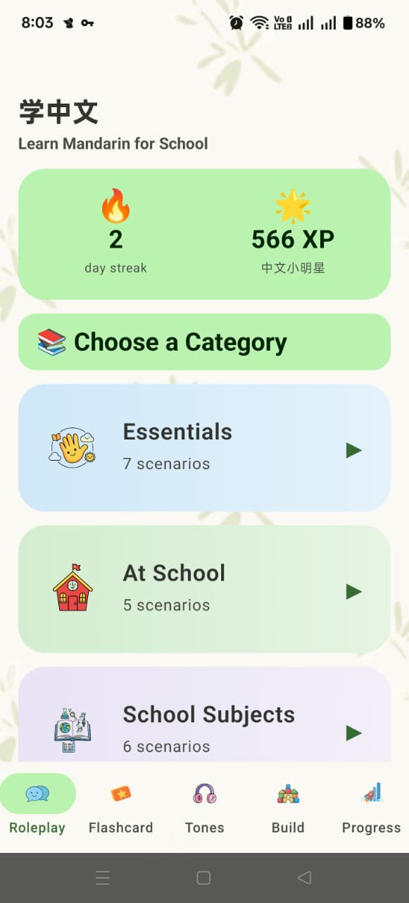
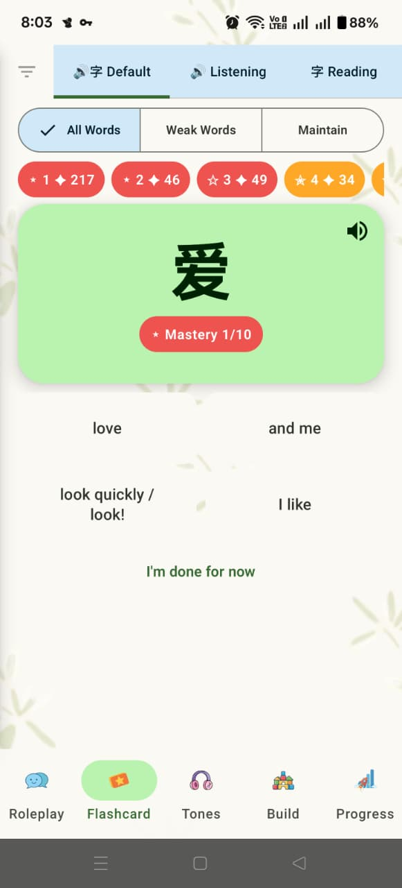
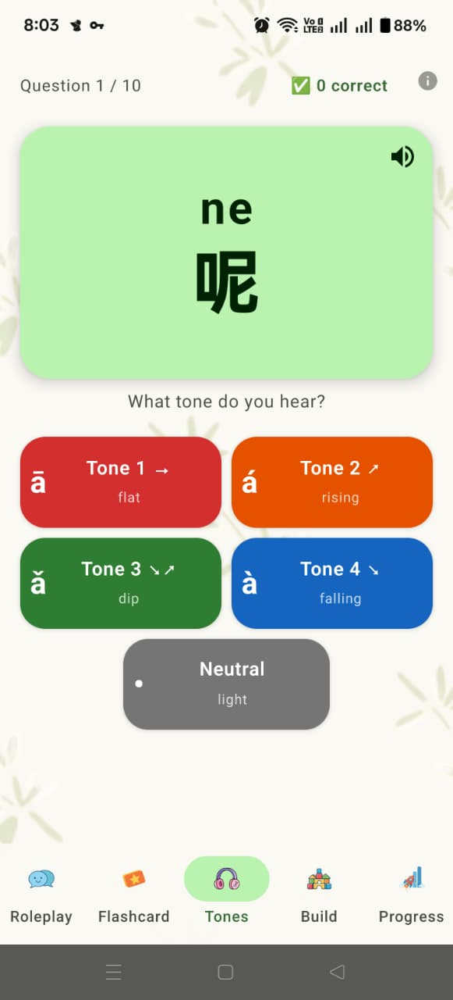
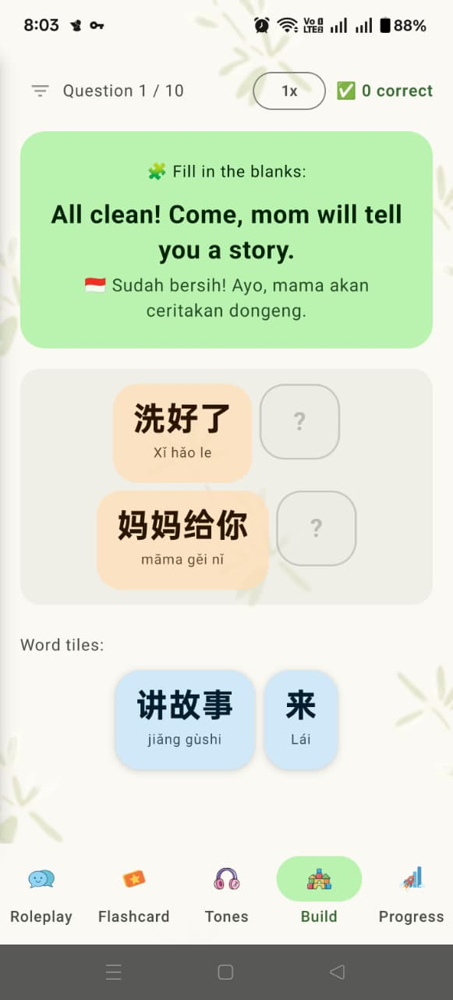
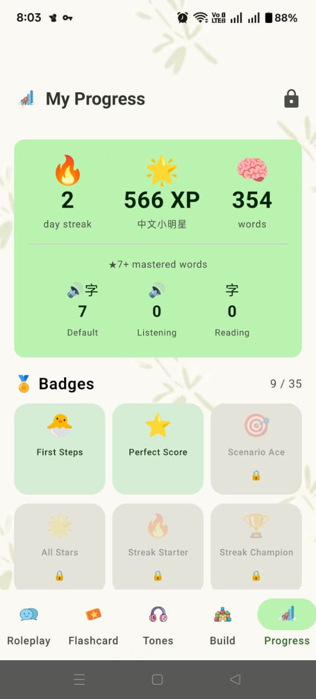
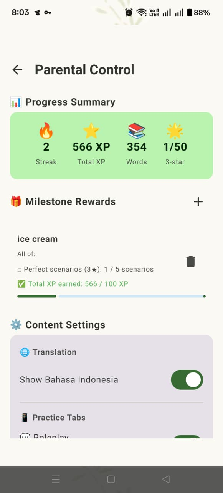

# Mandarinku 🇨🇳

[](https://github.com/mikhwan89/MiltonLearnMandarin/releases/download/v1.1.1/Mandarinku-v1.1.1.apk)

An Android app that teaches Mandarin Chinese to young children (age 4–8) through interactive role-play conversations, flashcard drills, tone training, and sentence-building games. Built by a dad for his son Milton.

---

## What It Does

Mandarinku puts a child in real-world situations and guides them through Mandarin at their own pace. Learning is split across four modes:

1. **Flashcards** — learn vocabulary before a conversation. Each card shows the Chinese character, pinyin (colour-coded by tone), English, and Indonesian translation. Tap to flip, mark as "Got it" or "Still learning".
2. **Role-play** — have a back-and-forth conversation with a character (teacher, classmate, etc.). Tap any pinyin word to see its tone colour, translation, and a child-friendly grammar note. Grammar particles like 了, 的, and 吗 include a plain-language tip so a 5-year-old understands what they do. Each role-play ends with a quiz — multiple-choice questions about what was just practised, with stars and XP awarded based on performance.
3. **Tone Trainer** — hear a spoken word and identify which of the four Mandarin tones it uses.
4. **Sentence Builder** — arrange pinyin tiles in the correct order to form a sentence.

Progress (stars, XP, streak, mastered words) is saved locally. Parents can unlock a dashboard with a PIN to view detailed progress, set reward milestones, and control which content is available.

---

## Screenshots

<p align="center">
  
  &nbsp;
  
  &nbsp;
  
</p>
<p align="center">
  
  &nbsp;
  
  &nbsp;
  
</p>

---

## Scenarios

The app includes **50 scenarios** across 7 categories:

| Category | Topics covered |
|----------|---------------|
| **Essentials** | Greetings, numbers, colours, basic phrases |
| **At School** | Meeting the teacher, asking for help, raising your hand, borrowing items, feeling unwell, resolving conflicts |
| **School Subjects** | Maths, science, art, music, PE — talking about what you study |
| **Food & Eating** | Snack time, lunch, ordering food, favourite foods |
| **Feelings & Health** | Expressing emotions, describing how you feel, visiting the nurse |
| **Play & Hobbies** | Playground games, sports, hobbies, weekend activities |
| **At Home** | Daily routines, chores, family interactions, bedtime |

All scenarios include Chinese, pinyin, English, and Indonesian text. Adding a new scenario requires only a single JSON file — no Kotlin changes needed.

---

## Tone Colour System

Pinyin is colour-coded by tone throughout the app — in flashcards, conversation bubbles, and the word detail popup. Multi-syllable words (e.g. **pángbiān** 旁边) show mixed colours, one per syllable:

| Colour | Tone | Mark | Example |
|--------|------|------|---------|
| 🔴 Red | Tone 1 — flat | ā | māo |
| 🟠 Orange | Tone 2 — rising | á | máo |
| 🟢 Green | Tone 3 — dip | ǎ | mǎo |
| 🔵 Blue | Tone 4 — falling | à | mào |
| ⚫ Grey | Neutral | (none) | ma, le, de |

---

## Tech Stack

| Layer | Technology |
|-------|-----------|
| Language | Kotlin 2.0.0 |
| UI | Jetpack Compose (BOM 2024.12.01), Material Design 3 |
| Navigation | Jetpack Navigation Compose 2.9.7 |
| State | `ViewModel` + `collectAsState()` |
| Local DB | Room 2.8.4 v8 (progress, mastered words, milestone rewards) |
| Preferences | DataStore Preferences 1.1.1 (speech rate, parental controls, feature flags) |
| Serialisation | kotlinx.serialization 1.7.3 (JSON scenario loading) |
| TTS | Android `TextToSpeech` with `Locale.CHINESE` |
| Build | AGP 9.0.1, KSP 2.2.10-2.0.2, Java 11 |
| Min SDK | 24 (Android 7.0) |
| Target SDK | 36 |

---

## Project Structure

```
app/src/main/
├── assets/
│   └── scenarios/              # 50 JSON scenario files + index.json
└── java/com/ikhwan/mandarinkids/
    ├── MainActivity.kt
    ├── RolePlayScreen.kt / RolePlayViewModel.kt
    ├── QuizScreen.kt / QuizViewModel.kt / QuizResultsScreen.kt
    ├── FlashcardScreen.kt / FlashcardViewModel.kt
    ├── ConversationBubble.kt   # pinyin pills, word detail popup
    ├── FeedbackCard.kt
    ├── PhrasesScreen.kt        # standalone phrase browser
    ├── ProgressManager.kt      # star calc, XP, badge unlock
    ├── ToneUtils.kt            # tone detection, colour mapping
    ├── data/
    │   ├── models/ScenarioModels.kt    # all @Serializable data classes
    │   └── scenarios/
    │       ├── ScenarioRepository.kt
    │       ├── JsonScenarioRepository.kt
    │       └── JsonScenarioLoader.kt
    ├── db/
    │   ├── AppDatabase.kt              # Room v8, 3 entities
    │   ├── ScenarioProgressEntity.kt
    │   ├── MasteredWordEntity.kt       # spaced repetition + practice type
    │   ├── PracticeType.kt             # DEFAULT | LISTENING | READING
    │   ├── MilestoneReward.kt          # multi-condition reward targets
    │   ├── ProgressDao.kt / MasteredWordDao.kt / MilestoneRewardDao.kt
    │   ├── ProgressRepository.kt
    │   └── Badge.kt
    ├── home/
    │   ├── HomeScreen.kt               # Roleplay tab — category list, word-of-day
    │   ├── ScenarioListScreen.kt
    │   └── ProgressScreen.kt           # Progress tab — XP, badges, parent entry
    ├── practice/
    │   ├── PracticeScreen.kt           # cross-scenario flashcard drill
    │   ├── PracticeSessionViewModel.kt
    │   ├── ToneTrainerScreen.kt        # tone recognition game
    │   ├── SentenceBuilderScreen.kt    # tile-arrangement game
    │   └── PracticeMode.kt
    ├── parent/
    │   ├── ParentDashboardScreen.kt    # PIN-gated progress + controls
    │   └── PinScreen.kt
    ├── navigation/
    │   ├── AppNavigation.kt            # NavHost, 5-tab bottom nav
    │   └── Routes.kt                   # route constants + URL builders
    ├── preferences/
    │   └── UserPreferencesRepository.kt  # DataStore: speech rate, parental controls
    ├── tts/
    │   └── TtsManager.kt
    └── ui/
        ├── ConfettiEffect.kt
        ├── StrokeOrderSheet.kt
        └── theme/ (Color.kt, Theme.kt, Type.kt)
```

---

## Data Model

```
Scenario
├── id, title, description, characterName, characterEmoji, characterRole
├── category: ScenarioCategory
├── dialogues: List<DialogueStep>
│   ├── speaker: Speaker (CHARACTER | STUDENT)
│   ├── textChinese, textPinyin, textEnglish, textIndonesian
│   ├── responseType (LISTEN_ONLY | SINGLE_CHOICE | MULTIPLE_OPTIONS | TEXT_INPUT)
│   ├── options: List<ResponseOption>
│   │   ├── chinese, pinyin, english, indonesian, isCorrect
│   │   └── pinyinWords: List<PinyinWord>
│   └── pinyinWords: List<PinyinWord>
│       ├── chinese, pinyin, english, indonesian
│       └── note: String?   ← child-friendly grammar tip
└── quizQuestions: List<QuizQuestion>
    ├── direction (CHINESE_TO_TRANSLATION | TRANSLATION_TO_CHINESE | AUDIO_TO_TRANSLATION)
    ├── questionText, questionChinese, questionPinyin
    ├── options: List<QuizOption>  (chinese, pinyin, translation)
    ├── correctAnswerIndex
    └── explanation
```

---

## Screen Flow

```
Bottom nav (5 tabs — individual tabs can be disabled by parents)
│
├── [Roleplay tab] HomeScreen
│     └── ScenarioListScreen (by category)
│           └── RolePlayScreen → QuizScreen → QuizResultsScreen
│                                                  └── retry ──┘
│
├── [Practice tab] PracticeScreen
│     └── FlashcardScreen (per scenario)
│
├── [Tone Trainer tab] ToneTrainerScreen
│
├── [Sentence Builder tab] SentenceBuilderScreen
│
└── [Progress tab] ProgressScreen
      └── PinScreen → ParentDashboardScreen
```

---

## Adding a New Scenario

No Kotlin needed. Create a JSON file in `app/src/main/assets/scenarios/` then **add its filename to `index.json`**:

```json
{
  "id": "scene51_your_id",
  "title": "场景标题",
  "description": "One-line description in English",
  "characterName": "角色名",
  "characterEmoji": "👩‍🏫",
  "characterRole": "Teacher",
  "category": "AT_SCHOOL",
  "dialogues": [
    {
      "id": 1,
      "speaker": "CHARACTER",
      "textChinese": "你好！",
      "textPinyin": "Nǐ hǎo!",
      "textEnglish": "Hello!",
      "textIndonesian": "Halo!",
      "responseType": "LISTEN_ONLY",
      "pinyinWords": [
        { "pinyin": "Nǐ", "chinese": "你", "english": "you", "indonesian": "kamu" },
        { "pinyin": "hǎo", "chinese": "好", "english": "good", "indonesian": "baik" }
      ]
    }
  ],
  "quizQuestions": [
    {
      "direction": "CHINESE_TO_TRANSLATION",
      "questionText": "What does 你好 mean?",
      "options": [
        { "chinese": "你好", "pinyin": "Nǐ hǎo", "translation": "Hello" },
        { "chinese": "再见", "pinyin": "Zài jiàn", "translation": "Goodbye" }
      ],
      "correctAnswerIndex": 0,
      "explanation": "你好 means Hello"
    }
  ]
}
```

**Tips:**
- `category` must be one of: `ESSENTIALS`, `AT_SCHOOL`, `SCHOOL_SUBJECTS`, `FOOD_AND_EATING`, `FEELINGS_AND_HEALTH`, `PLAY_AND_HOBBIES`
- `speaker`: `"CHARACTER"` or `"STUDENT"`
- `responseType`: `"LISTEN_ONLY"`, `"SINGLE_CHOICE"`, `"MULTIPLE_OPTIONS"`, `"TEXT_INPUT"`
- `direction`: `"CHINESE_TO_TRANSLATION"`, `"TRANSLATION_TO_CHINESE"`, or `"AUDIO_TO_TRANSLATION"`
- Add a `"note"` to any `pinyinWord` that needs a grammar explanation (especially particles 了, 的, 吗)
- Both English and Indonesian are required on every text field

---

## Building & Running

```bash
# Clone
git clone https://github.com/mikhwan89/MiltonLearnMandarin.git
cd MiltonLearnMandarin

# Run from Android Studio terminal (uses bundled JDK)
./gradlew assembleDebug        # build debug APK
./gradlew assembleRelease      # build release APK
./gradlew test                 # run unit tests (JVM, no device needed)
./gradlew connectedAndroidTest # run instrumented tests (requires device/emulator)
./gradlew lint                 # lint check
./gradlew clean                # clean build outputs
```

Requires **Android Studio Hedgehog or newer**. Uses AGP 9.0.1 with KSP — no separate Kotlin plugin installation needed.

---

## Unit Tests

Pure JVM tests live in `app/src/test/` — no emulator or Robolectric required:

| Test file | What it covers |
|-----------|---------------|
| `ProgressManagerTest` | `calculateStars` thresholds, `getLevel` / `getLevelLabel` boundaries |
| `QuizViewModelTest` | `selectAnswer` scoring, guard against double-answer, `advanceQuestion` state transitions |
| `RolePlayViewModelTest` | Step progression, `submitName`, `selectOption`, speech speed toggle |
| `JsonParsingTest` | Scenario JSON parsing, optional field defaults, unknown field tolerance |
| `TestFixtures` | Shared test data builders (`testScenario`, `testDialogueStep`, etc.) |

---

## Offline First

The app works entirely offline. All scenario content is bundled as JSON assets. TTS uses the Android system TTS engine (requires Chinese TTS pack installed on device). No network calls are made.

---

## License

This project is released into the public domain under the [MIT License](LICENSE). Feel free to copy, fork, modify, and use it for anything — no permission needed. Built with ❤️ for Milton.
